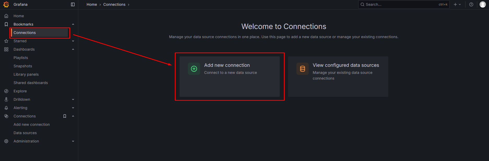
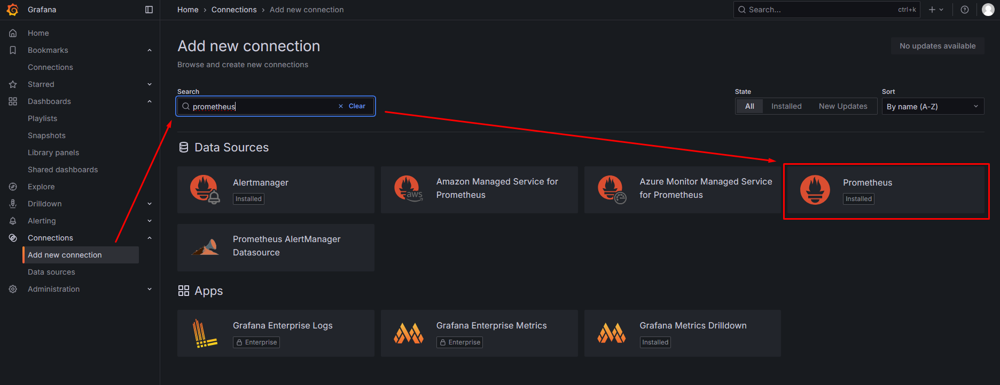

Prometheus dan Grafana adalah alat monitoring yang saling melengkapi.Jadi Prometheus digunakan untuk mengumpukan Data dan Grafana digunakan untuk menampikan data dari prometheus secara interaktif dan profesional untuk dilihat.

Jadi Prometheus sering digunakan untuk mengumpulkan data data seperti:
- CPU usage dari container 
- Memory usage dari Node 
- Network traffic 
- DLL. 

Grafana berguna untuk menampikan semua data dari Prometheus, Grafana mengambil datanya lalu menampilkannya dengan cara yang profesional dan interaktif memudahkan seorang engineer IT melakukan monitoring dan problem solving yang cepat.

# Implementasi konfigurasi Prometheus + Grafana + Docker 

## Install Prometheus 
1. Buat User Khusus
```bash 
sudo useradd --no-create-home --shell /bin/false prometheus
```

2. Unduh lalu ekstrak Prometheus 
```bash
# Ganti URL dengan versi terbaru jika ada
wget https://github.com/prometheus/prometheus/releases/download/v2.51.1/prometheus-2.51.1.linux-amd64.tar.gz
tar xvfz prometheus-*.tar.gz
cd prometheus-*.linux-amd64
```

3. Pindah file lalu atur permission
```bash 
sudo mv prometheus promtool /usr/local/bin/
sudo chown prometheus:prometheus /usr/local/bin/prometheus /usr/local/bin/promtool

sudo mkdir /etc/prometheus /var/lib/prometheus
sudo mv prometheus.yml /etc/prometheus/
sudo mv consoles console_libraries /etc/prometheus/
sudo chown -R prometheus:prometheus /etc/prometheus /var/lib/prometheus
```

4. Buat file Systemd
```bash
sudo vi /etc/systemd/system/prometheus.service
```

Lalu tempel konfigurasi berikut 
```bash
[Unit]
Description=Prometheus
Wants=network-online.target
After=network-online.target

[Service]
User=prometheus
Group=prometheus
Type=simple
ExecStart=/usr/local/bin/prometheus \
    --config.file /etc/prometheus/prometheus.yml \
    --storage.tsdb.path /var/lib/prometheus/ \
    --web.console.templates=/etc/prometheus/consoles \
    --web.console.libraries=/etc/prometheus/console_libraries

[Install]
WantedBy=multi-user.target
```

5. Jalankan Prometheus 
```bash
sudo systemctl daemon-reload
sudo systemctl start prometheus
sudo systemctl enable prometheus # Agar otomatis berjalan saat boot
sudo systemctl status prometheus
```
note: Prometheus akan berjalan di port 9090 bisa dibuka melalui Web Browser, Contoh http://<IP_SERVER_ANDA>:9090.

## Install Grafana 

1. Tambahkan Repository Grafana
```bash
sudo apt-get install -y apt-transport-https software-properties-common wget
sudo mkdir -p /etc/apt/keyrings/
wget -q -O - https://apt.grafana.com/gpg.key | gpg --dearmor | sudo tee /etc/apt/keyrings/grafana.gpg > /dev/null
echo "deb [signed-by=/etc/apt/keyrings/grafana.gpg] https://apt.grafana.com stable main" | sudo tee /etc/apt/sources.list.d/grafana.list
```

2. Install dan Jalankan Grafana
```bash
sudo apt-get update
sudo apt-get install grafana
sudo systemctl daemon-reload
sudo systemctl start grafana-server
sudo systemctl enable grafana-server.service # Agar otomatis berjalan saat boot
```
note: Grafana akan berjalan di port 3000 bisa dibuka melalui Web Browser, http://<IP_SERVER_ANDA>:3000.

## Menghubungkan Prometheus ke Grafana

1. Buka Dashboard Grafana 
2. Di menu kiri pilih Connections --> Add New Connection (Add New Data Source) 

3. Klik pilihan Prometheus 


4. Pada bagian Prometheus server URL, masukkan alamat Prometheus, Jika menggunakan metode VM atau Docker di server yang sama: http://localhost:9090

5. Jika Grafana dan Prometheus berada di VM yang berbeda, gunakan alamat IP Prometheus: http://<IP_PROMETHEUS>:9090. Untuk Docker, ini adalah IP dari host Docker, bukan container.

6. Klik Save & test.akan melihat notifikasi "Data source is working".
