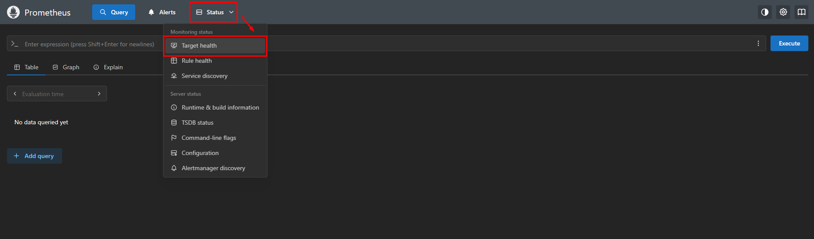
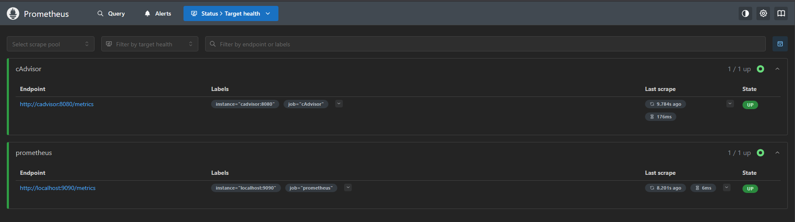
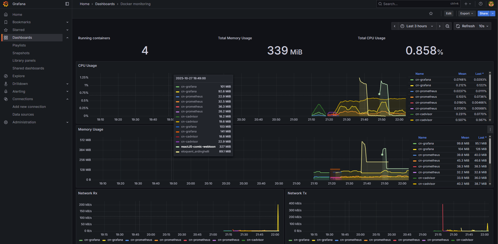

# DOCKERIZE GRAFANA PROMETHEUS
Di project ini saya melakukan Dockerize atau membuat container untuk Grafana dan Prometheus menggunakan Docker Compose tentu saja dengan gabungan cAdvisor untuk membuat saya bisa sekaligus memonitoring penggunaan CPU dan Memory dari masing-masing Container.

## Implementasi Konfigurasi

1. Menjalankan Docker Compose
```bash
rouf@rouf:~/monitoring-stack$ docker compose up -d
WARN[0000] /home/rouf/monitoring-stack/docker-compose.yaml: the attribute `version` is obsolete, it will be ignored, please remove it to avoid potential confusion
[+] Running 4/4
 ✔ Network monitoring-stack_default  Created                                                                                                                                        0.4s
 ✔ Container cn-prometheus           Started                                                                                                                                        2.4s
 ✔ Container cn-cadvisor             Started                                                                                                                                        2.2s
 ✔ Container cn-grafana              Started 
 ```

 2. Buka Prometheus di browser pada port 9090, Lalu buka menu di navbar bernama status lalu klik pilihan Target Health
 

 3. Verifikaisi Endpoint ke cAdvisor dan Prometheus Berhasil dengan status UP
 

 4. Jika sudah pindah ke Tab baru masuk ke Dashboard Grafana dengan Port 3000, Masukan username admin passowrd nya admin, Lalu ubah.Ikuti langkah berikut :
    - Klik tab sebelah kiri bernama connection --> Klik Add New Data Source --> Pilih Prometheus --> Masukan name Prometheusnya contoh "container-prometheus" --> Masukan Prometheus Server URL contoh disini saya masukan (http://10.10.10.18:9090). 
    - Scroll ke bawah klik Save & Test sampai ada notif "Data source is working"

5. Import Dashboard caranya: 
    - Klik tab Dashboard --> Klik New --> Klik Import
    - Masukan ID 193 lalu Klik Load
    - Klik pilihan Prometheus --> Lalu Klik Nama Prometheus yang telah dibuat 

Hasil dari Import Dashboard
