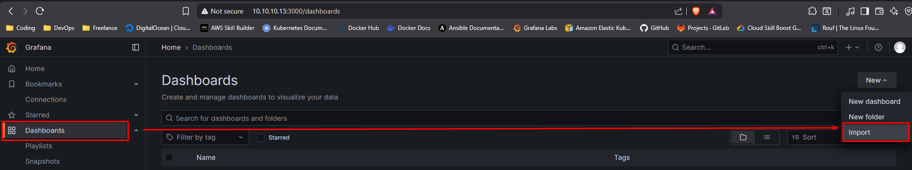
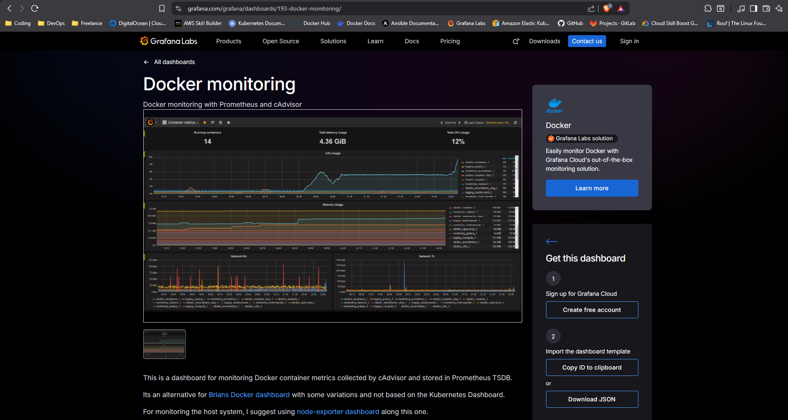
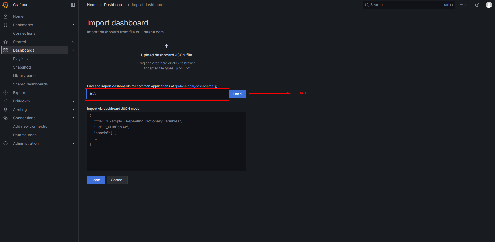
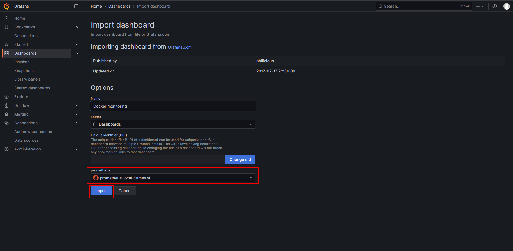
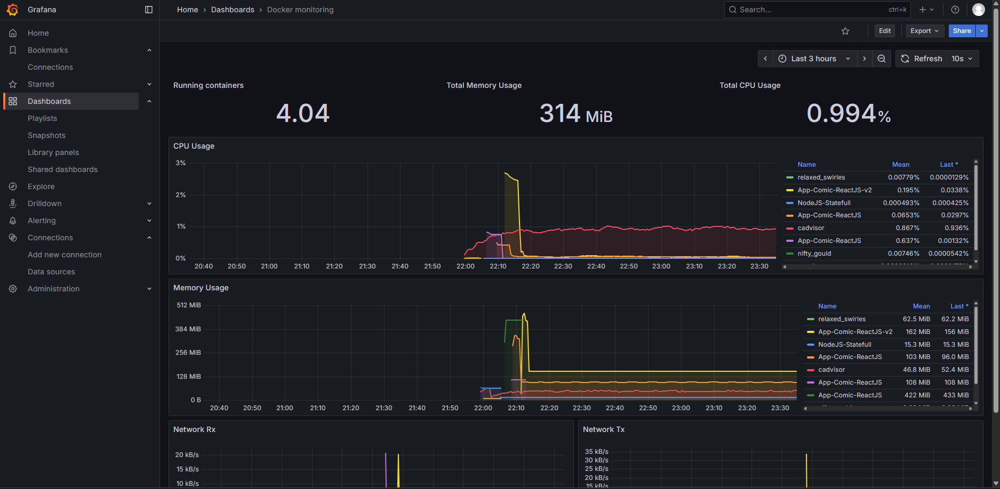

# Monitoring Docker Daemon

1. Mengaktifkan Metric Docker Daemon
```bash
sudo vi /etc/docker/daemon.json
```

2. Isi file dengan konfigurasi berikut 
```bash
{
  "metrics-addr" : "127.0.0.1:9323",
  "experimental" : true
}
```

3. Simpan file dan restart Docker
```bash
sudo systemctl restart docker
```

4. Konfigurasi Prometheus untuk Scrape Docker 
```bash
sudo vi /etc/prometheus/prometheus.yml
```

5. Tambahkan Job baru dibawah kode "scrape_configs"
```bash
  # Jangan Hapus Job di atasnya
  # TAMBAHKAN JOB BARU DI BAWAH INI
  - job_name: 'docker'
    static_configs:
      - targets: ['localhost:9323']
```

6. Simpan file lalu restart Prometheus untuk menerapkan perubahan
```bash
sudo systemctl restart prometheus
```

7. Import Dashboard Grafana 
- Buka Grafana di Browser pada port 3000, Lalu Klik menu Dashboard klik Import


8. Buka Web https://grafana.com/ lalu klik menu Search ketik "193", Setelah itu Klik pilihan paling atas bernama Docker Monitoring.Lalu Klik "Copy ID to clipboard"


9. Lanjutkan Klik Import, Masukan ID setelah itu klik tombol LOAD 


10. Pilih Prometheus yang telah dimasukan, Klik import


11. Setelah itu akan muncul tampilan dashboard Grafana yang berisi Metric monitoring Docker dan Containernya


12. Setelah itu Save tampilan Dashboard: save dashboard --> Save


