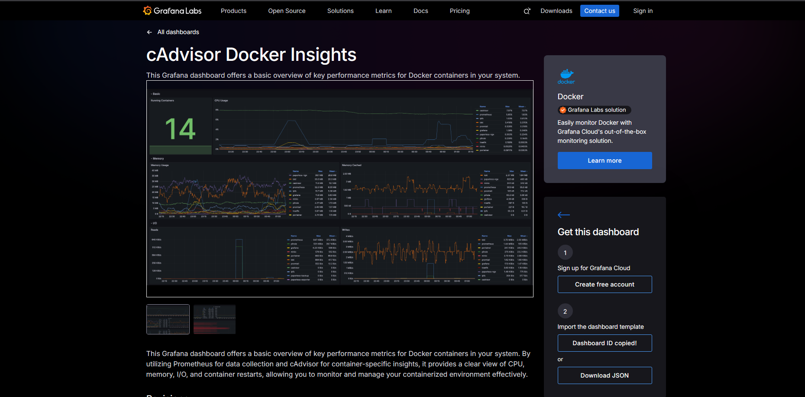

# Monitoring Docker with cAdvisor
cAdvisor adalah tools open source dari Google yang berguna monitoring container dan mengumpulkan dan mengekspor traffic container seperti penggunaan CPU, Memory, dan Network Traffic.Dengan menggunakan cAdvisor nantinya Grafana dan Prometheus dapat menampilkan resource yang lebih lengkap dari container, Tidak hanya berapa jumlah container dan nama container dari docker nantinya dengan memakai cAdvisor bisa memantau penggunaan CPU, Memory, Network Traffic dari masing masing Container dari Docker

1. Jalankan Container cAdvisor
```bash
sudo docker run \
  --volume=/:/rootfs:ro \
  --volume=/var/run:/var/run:rw \
  --volume=/sys:/sys:ro \
  --volume=/var/lib/docker/:/var/lib/docker:ro \
  --publish=8080:8080 \
  --detach=true \
  --name=cadvisor \
  --privileged \
  gcr.io/cadvisor/cadvisor:latest
```

2. Konfigurasi Prometheus untuk Scrape cAdvisor, Edit file konfig prometheus. 
```bash
sudo vi /etc/prometheus/prometheus.yml
```
Lalu isi file dengan menambahkan Job berikut 
```bash
# ... (job prometheus dan/atau job docker Anda)

  # TAMBAHKAN JOB BARU DI BAWAH INI
  - job_name: 'cadvisor'
    static_configs:
      - targets: ['localhost:8080']
```

3. Simpan file lalu Restart Prometheus
```bash
sudo systemctl restart prometheus
```

4. Pergi ke Dashboards -> New -> Import

5. Masukan ID 19908 untuk Dashboard tampilan dengan kombinasi cAdvisor 


6. Lalu di Halaman import Dashboard bisa dimasukan ID nya lalu Klik LOAD
note: Lihat ini dulu supaya tahu cara import dashboard https://github.com/MochamadAbdulRouf/Grafana-Prometheus-Docker/tree/main/monitoring-docker-daemon